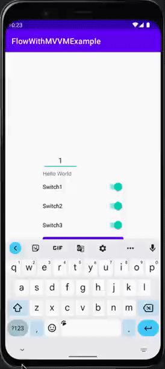

# Flow With MVVM Example

## dependencies

- androidx.core:core-ktx:1.8.0
- androidx.appcompat:appcompat:1.4.2
- com.google.android.material:material:1.6.1
- androidx.constraintlayout:constraintlayout:2.1.4
- androidx.lifecycle:lifecycle-runtime-ktx:2.5.0
- androidx.lifecycle:lifecycle-viewmodel-ktx:2.5.0
- androidx.fragment:fragment-ktx:1.4.1
- org.jetbrains.kotlinx:kotlinx-coroutines-android:1.6.1

## Key Concept

- observer base implementation
- two way data binding
- usage of StateFlow and SharedFlow
